# The Wine Society

This website is a specialist shop with a blog. A place for wine enthusiasts. The shop will sell wine from different parts of the world.

## Table of Contents

- Introduction
- Business Model
- Preparation
	 - Wireframe
	 - Agile / Github issues and projects
- Features
	 - Homepage
	 - Shop
	 - blog
	 - Site management
- Technologies
	 - Django
	 - SQL Database
	 - Stripe
	 - Heroku
	 - AWS
- Marketing
- Testing
- Deployment
- Bugs
- Credits
- Acknowledgements

## Introduction

## Business Model

The site is built around a community and follows a business-to-customer B-to-C model. The site will offer a traditional retail experience, with the goal of engaging customers who are interested in the product and want to learn more about its background, attend tastings, and hear talks from winemakers and other industry specialists. The wine club will produce informative and engaging blog posts, host wine tasting events, and offer member discounts and monthly wine samples curated around themes and events. The business will also offer products related to wine, including wine glasses, decanters, wine openers, and other related products.  

## Preparation

### Wireframes

I used Balsamiq to layout my design. To have a better understanding of the design and functionality, I took some time to examine and dissect other websites that I found enjoyable.

### Product Page

 ### Shop

### Basket

### Agile Development

In the development of this e-commerce Django site, agile methodologies were employed. The project was organised into various tasks, contributing to overarching epics that represented large-scale features and goals. In order to track the progress and ensure the achievement of stages, the project timeline included setting milestones at key points.

User stories were created and divided between the site owner and the customer to represent the different requirements and positions of these two groups. User stories covered issues like customer management and inventory control for the website owner. The focus for the customer was on enhancing the user experience through seamless navigation, efficient checkouts, and intuitive search functionalities. By combining Agile practices with clearly defined milestones, I was able to prioritise work, adapt to changes, and hopefully produce a functional e-commerce website.

Link to my GitHub project page:

[Github project](https://github.com/users/Shane-Bath/projects/5/views/1?layout=board)

### Agile User Stories

## Features

### Homepage

The homepage will feature a large hero image with the title of the business. The image will take up 100% of the viewport. The page will prominently display the shop link. The website owner will be able to use this landing page to create a theme for the site, either to promote a product, an event, or a season.

As the user scrolls down, they will see bold images with links to different sections of the shop. For example, a "Bold Reds" image would bring the user to a curated selection of red wines. The homepage will also contain links to the blog and wine club, along with information about upcoming events.

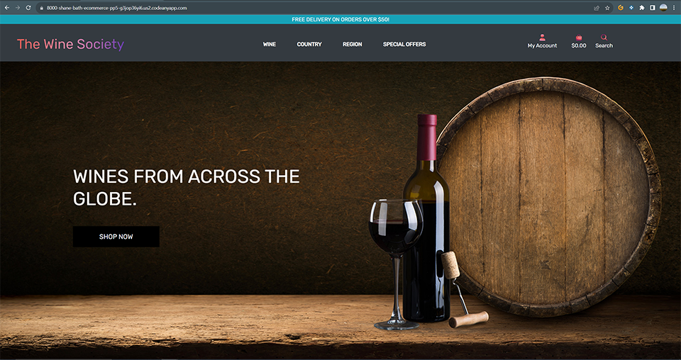

## Shop

### Product Page

Product Page

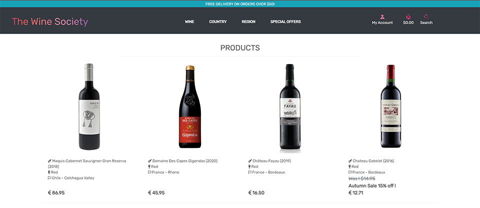

### Product detail

Product Details

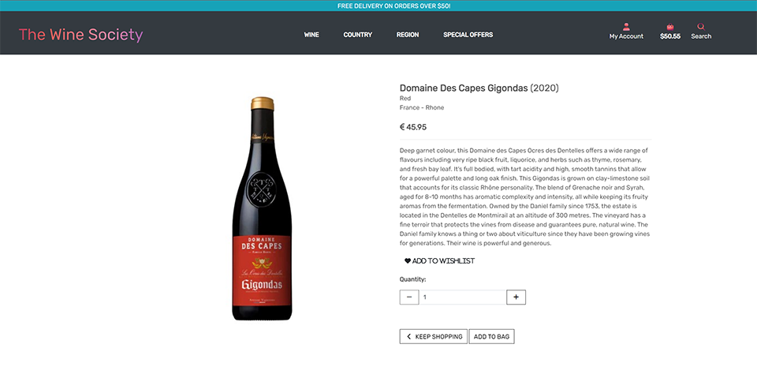

### Shopping bag

Shopping Bag

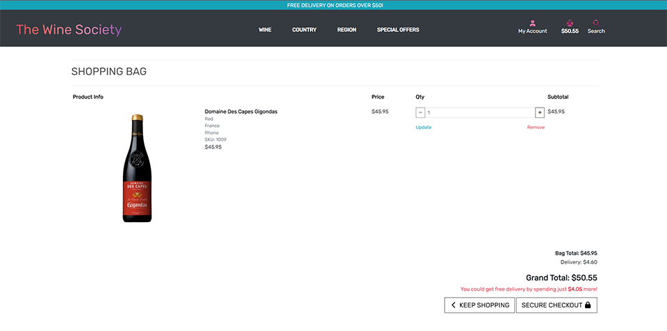

### Checkout

Checkout

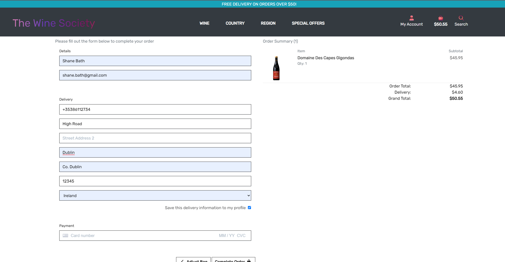

### Footer

The footer has links to the contact us page and the newsletter signup page.

Footer

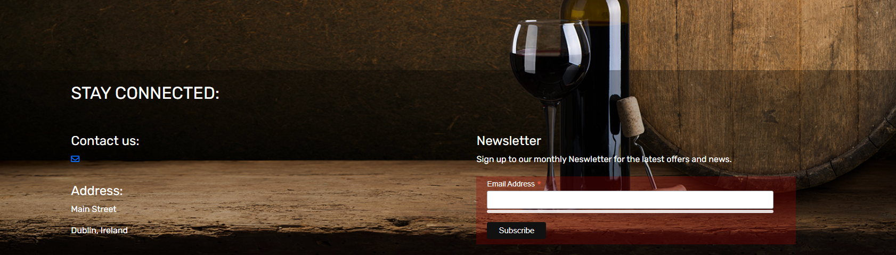

### Contact us

The footer has links to the contact us page and the newsletter signup page.

Contact page

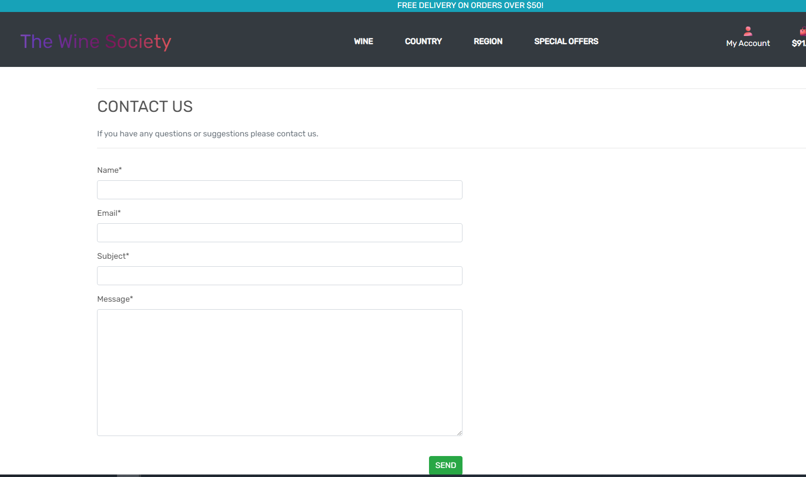

### Wishlist

### Blog

## Technologies*

### Languages

- HTML
- CSS
- JavaScript
- Python

### Programs, Libraires and Programs

- Django
- Django Allauth
- Codeanywhere
- Heroku
- Elephant SQL
- Amazon Web Services
- Stripe

## Marketing
Leveraging both Facebook and a dedicated blog, I aim to create a dynamic online presence for my wine shop. Facebook is invaluable for real-time engagement, where the I can post daily updates on new arrivals, special promotions, and upcoming tasting events.

  
Facebook page screenshots

  ### Facebook
  
  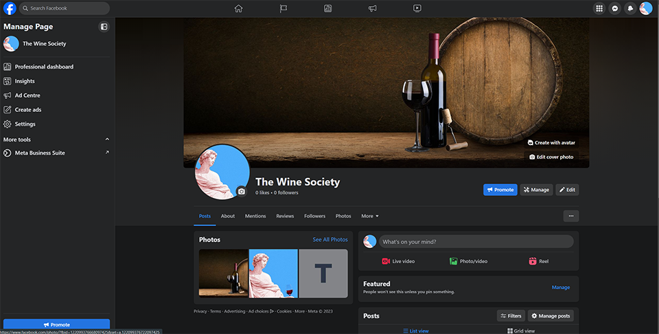
  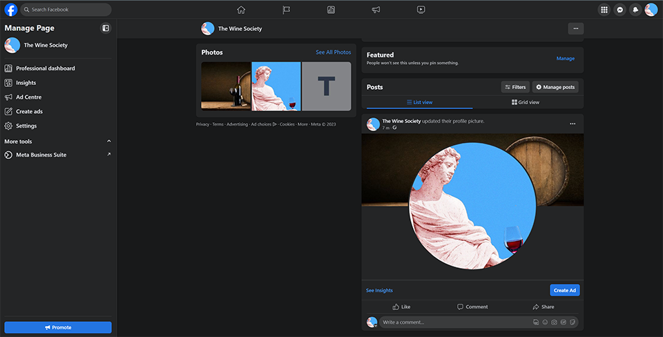

### Blog

The blog, on the other hand, serves as a platform for more in-depth content, including wine pairing guides and interviews with vineyard owners. Together, these platcforms not only attract new customers but also build a community of wine enthusiasts.

A wine blog can be used to populate other marketing channels, such as Facebook and Instagram, with engaging and informative content. Additionally, Google places higher ranking on authoritative sources, so a regularly updated blog can assist the overall business with SEO rankings.

  
blog page screenshots

### Blog
  
  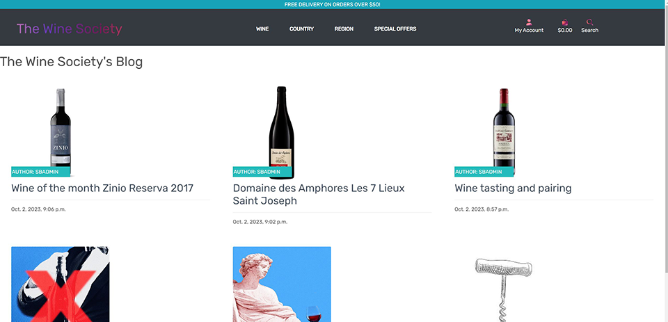
  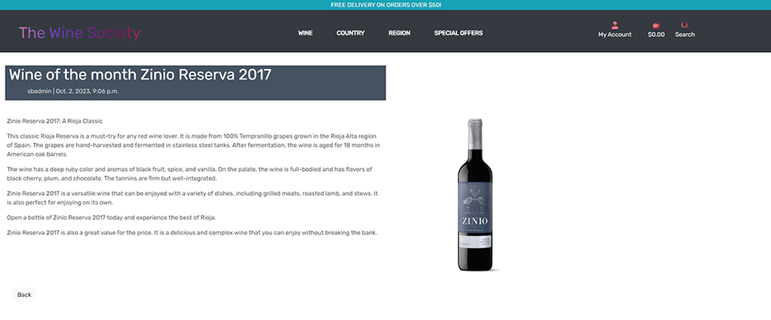

### Newsletter

The user can sign up to a newsletter. This was created using mailchimp. 

  
Newsletter

  
  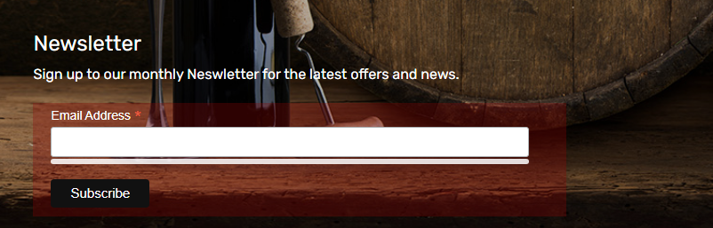
  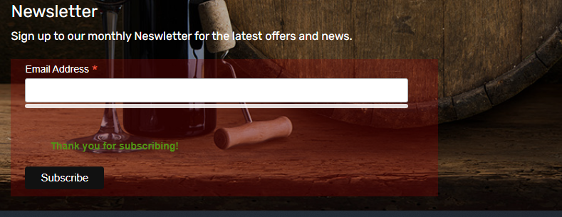
  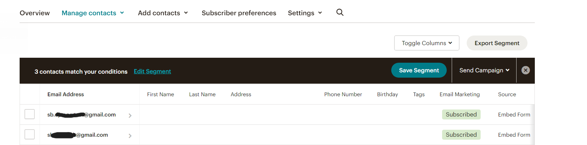
  

## Database
ElephantSQL hosts the site's PostgreSQL server. Postgres is a free and open-source 
relational database management system. ElephantAQL will manage the administrative 
tasks of the database. The database comprises tables for products and product 
categories, which include style, colour, regions, and countries. Which will allow 
the owner of the site to upload products and categorise them appropriately to 
ensure that the users of the site will be able to find the products.

The owner will be able to grow the type of products as the business develops, as 
there is flexibility with the database to continue to add to the existing database.
 The owner can add and delete products and categories in the admin section of the 
 website.

 Database schema 

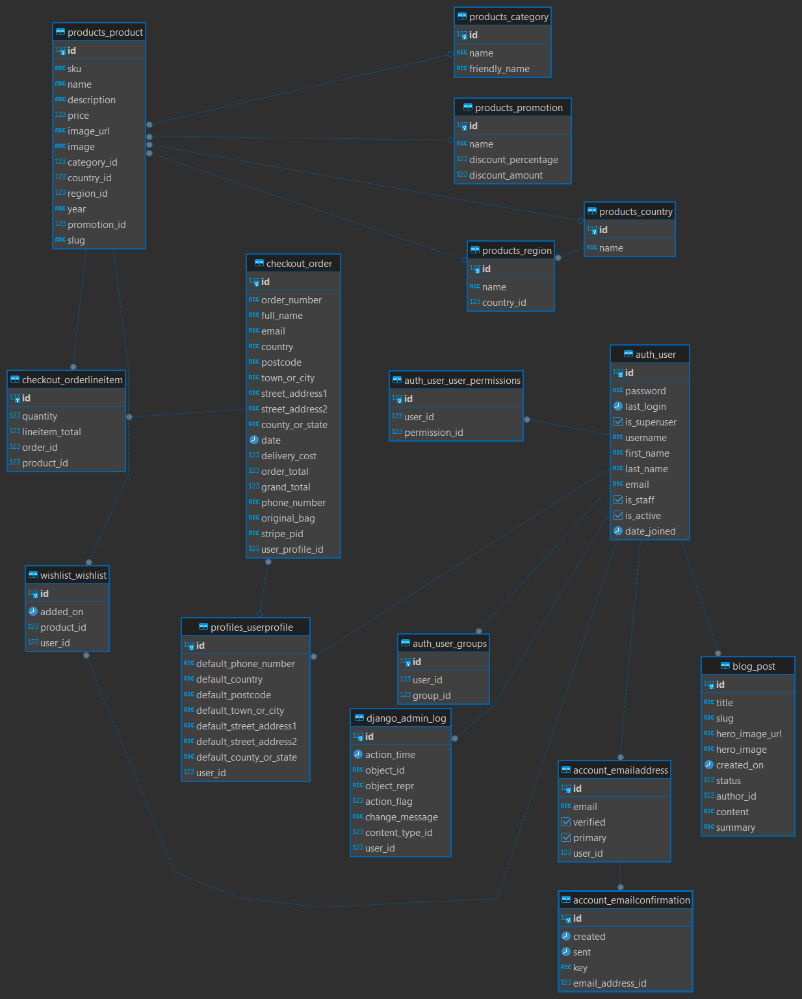

## Testing

## Manual Testing 
### Registration

| Objective | Test | Expected result | Passed |
| :---:     | :---:|    :---:        | :---:  |
| Check if registration works | Click on my account, click register. Complete the registration form. Click sign up. | An email will be sent to sign up email and ask the user to confirm email | Passed |
| Check if login works | Click on my account, click  login Complete the login form. Click login | Home page to open, success toast display confirming login. | Passed |
| Check if logout works | Click on my account, click logout. | Sign out page displayed and the user is asked to sign out. After the signed out the user is returned to the home page.| Passed |

### Navigation link

| Objective | Test | Expected result | Passed |
| :---:     | :---:|    :---:        | :---:  |
| Check shop now button works | Click on the Shop now button, on the home page | User is redirected to the product page | Passed |
| Check logo button works | Click on the logo, The Wine Society on the top left corner of the page | User is redirected to the home page | Passed |
| Check navigation link works | Click on any of the Navigation links | A drop down list appears with further category links | Passed |
| Check if navigation category links work (Wine) | Click on eack category links | User is redirected to the category page and only display product associated with each category | Passed |
| Check if navigation country links work | Click on each country link | User is redirected to the country page and only display product associated with each country | Passed |
| Check if navigation region links works | Click on each region link | User is redirected to the region page and only display product associated with each region | Passed |
| Check if special offers links works | Click on each special offer link | User is redirected to the special offer page and only display product associated with each special offer | Passed |

### Products Page and Product details page

| Objective | Test | Expected result | Passed |
| :---:     | :---:|    :---:        | :---:  |
| Check if product image link works | Click on product image | User is redirected to the product details page | Passed |
| Check if add to wishlist link works | Click on Add to wishlist link | User is redirected to the wishlist page | Passed |
| Check if quantity buttons works | Click on the increment and decrement buttons | The value increases and decrease | Passed |
| Check if quantity limits works | Click on the increment and decrement buttons | The value does not pass below 1 or above 99 | Passed |
| Check if Add to bag button works| Click on the add to bag button | The user is shown a Success Toast, the product is displayed in the toast with  the correct quantity | Passed | 
| Check if Go to secure checkout works | Click on the Go to secure checkout button | The user is redirected to the shopping bag  the product is displayed in the bag with  the correct quantity | Passed |
| Check if the product image will display in a seperate tab | Click on the product image | A new tab open with the product image | Passed |
| Check if the keep shopping button works | Click on the keep shopping button | User is redirected to the products page | Passed |

### Wishlist
| Objective | Test | Expected result | Passed |
| :---:     | :---:|    :---:        | :---:  |
| Check if Description link in wishlist works | Click on the product description link | User is redirected to the product page | Passed |
| Check if delete button works | Click on the delete button | The product is removed from the wishlist | Passed |
| Check if the Add to bag button works | Click on the add to bag button | The product is add to the bag | Passed |

### Bag
| Objective | Test | Expected result | Passed |
| :---:     | :---:|    :---:        | :---:  |
| Check if the increment button works | Check if the increment button works | The quantity increases | Passed |
| Check if the decrement button works | Click on the decrement button | The quantity decreases | Failed |
| Check if the Remove link works | Click on the remove link | The product is removed from the bag | Passed |
| Check if the update link works | Click on the update link | The quantity of the product is changed based on the new quantity | Passed |
| Check if the secure checkout button works | Click on the secure checkout button | The user is redirected to the checkout page | Passed |
| Check if the  keep shopping button works | Click on the checkout button | The user is redirected to the product page | Passed |

### Checkout
| Objective | Test | Expected result | Passed |
| :---:     | :---:|    :---:        | :---:  |
| Check if the checkout information form accepts the correct values | Complete the checkout form | The user is notified if the user has left out required information or inputted the incorrect value | Passed |
| Check if the credit card validation works | Complete the payment form | The user is notified if the user has inputted a invalid credit card number | Passed |
| Check if the complete order button works | Click the complete order button  | The user is redirected to successful checkout page with the information about the purchase | Passed |

### Profile
| Objective | Test | Expected result | Passed |
| :---:     | :---:|    :---:        | :---:  |
| Check if the user information is saved from checkout | Complete the checkout form and complete a sale | The user information is saved | Passed |
| Check if the user information is saved from profile | Complete the profile form and | The user information is saved| Passed |
| Check if the user can edit information | Edit a field and click update button | The user information is updated | Passed |
| Check if the user purchase history is saved | Complete the checkout form and complete a sale | The user purchase history is diplayed in the users profile | Passed |
| Check if the add to wishlist works | Click on the add to wishlist link | User is user  is redirected to the wishlist page and the product is displayed | User is user  is redirected to the wishlist page and the product is displayed | Passed |

### Other
| Objective | Test | Expected result | Passed |
| :---:     | :---:|    :---:        | :---:  |
| Check my account works | Click on my account button in navigation bar | A dropdown list is displayed | Passed |
| Check if my account links works | Click on each of the my account dropdowm options | The user is redirected to the appropriate pages | Passed |
| Check if bag link link works | Click on bag icon | The user is redirected to the bag section | Passed |
| Check if search icon works | Click on the search icon | The user is redirected to a search modal | Passed |
| Check if search function works | Add search creatria to the search box | Products are returned in the products page that matches the search critrea | Passed |

The website was tested for markup and CSS validation along with javascript, responsive design.

The python code was run through Code Institute's Pep8 Linter to check for errors. It passed with no errors expect for line length.
- Products models
Results:
50: E501 line too long (91 > 79 characters)
96: E501 line too long (85 > 79 characters)
98: E501 line too long (84 > 79 characters)

- Checkout Webhook and webhook handler
81: E501 line too long (80 > 79 characters)
82: E501 line too long (80 > 79 characters)
83: E501 line too long (80 > 79 characters)
111: E501 line too long (89 > 79 characters)
119: E501 line too long (107 > 79 characters)
163: E501 line too long (93 > 79 characters)

- Checkout models
15: E501 line too long (122 > 79 characters)
26: E501 line too long (94 > 79 characters)
27: E501 line too long (93 > 79 characters)
28: E501 line too long (92 > 79 characters)
30: E501 line too long (86 > 79 characters)
65: E501 line too long (113 > 79 characters)
66: E501 line too long (91 > 79 characters)
68: E501 line too long (113 > 79 characters)
74: E501 line too long (109 > 79 characters)

As they do not impact the website, I have left them in place to avoid creating issues.

- HTML W3C
-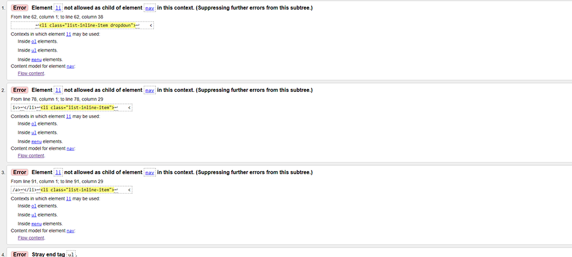
    - This validator showed several errors in relation to li items as children of nav element. Unfortunately, I was unable to locate the shown errors in the code in order to fix them before submission. 
    - I was able to fix the error casued by a gap in the URL using urlencode to replace the gap with %20.
  - Error: Duplicate ID user-options. I was unable to locate the duplication before deployment. It has not impacted the functionality of the site

- CSS W3C
-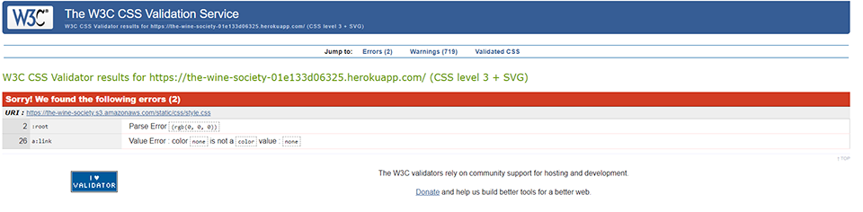
   -  Two error which one which I corrected, the second issue was not resolved before deployment.

I manually tested the site, dicovering and resolving a number of bugs. I used prints statements and console log as my main tools for fixing the the issues. I with statments I would be able see each step and indentify the issues.

## Deployment

1.	Set a repository on GitHub using the CI template from code institute.  
2.	Set up workspace within Codeanywhere by using GitHub repository.
3.	Once workspace has been created, install Django, pip3 install ‘django<4’
4.	Create a new project, use django-admin startproject the_wine_society
5.	Create gitignore file, touch .gitignore and add *.pyc,*.sqlite3, _pycahe_
6.	Run the project using django3 manage.py runserver
7.	Add to ‘8000-shane-bath-ecommerce-pp5-g3jop36yi6.us2.codeanyapp.com’ to ALLOWED_HOSTS = [] settings.py
8.	Once you have confirmed that the server is working, stop the server and complete you first migration. Run python3 manage.py migrate
9.	Create a super user, run python3 manange.py createsuperuser and create as username with password
10.	Commit changes to the github repository, run git add . , git commit -m “initial commit”. Git push
11.	Create a databasae, I used ElephantSQL, create a new database using the tiny turtle level. Name you database, select the region closes to you and create new instance
12.	Deploy the app to Heroku, select create new app, name the app and select Europe. Create the app.
13.	Configure the database in Heroku, go to settings, select revel config vars. Add DATABASE_URL and paste in the postgres URL from ElephantSQL. Click add.
14.	Inistall dj_database_ url and psycoppd2, run pip3 install dj_database_url==0.5.0 psycopg2 in the terminal
15.	Add the packages to requirements.txt run pip3 freeze > requirements.txt
16.	In settings.py add import os and import dj_database_url
17.	Add the new elephantSQL database url to env.py:
DATABASES = {
     'default': dj_database_url.parse('your-database-url-here')
 }
18.	Install gunicorn, run pip3 install gunicorn
19.	Add the gunicorn to requirements.txt run pip3 freeze > requirements.txt
20.	In the Heroku app disable STATIC file, in the reveal config section under setting add: DISABLE_COLLLECTSTATIC and 1. Click add
21.	In Heroku reveal config section, add SECRET_KEY and add a password
22.	Add PORT and 8000 to Heroku config var section
23.	In settings.py replace the SECRET_KEY with the following, SECRET_KEY = os.environ.get(‘SECRET_KEY, ‘ ‘)
24.	In settings.py change debug from TRUE to 'DEVELOPMENT' in os.environ
25.	In settings.py add if os.path.isfile('env.py'): import env
26.	Run python manage.py migrate to migrate to the ElephantSQL database
27.	Created and  deployed AWS bucket added keys to the Heroku config files

The live site can be found here: https://the-wine-society-01e133d06325.herokuapp.com/

## Bug Report:

### Issue with quantity update in shopping bag
#### Description:

An issue has been identified with the decrement button functionality within the shopping bag's item quantity management script. When a user adds 1 item to the shopping bag and then modifies the quantity using the increment button, the decrement button does not properly activate to decrease the quantity. It remains disabled until the 'update' link is clicked.

#### Steps to Reproduce:

 - Add an item with a quantity of 1 to the shopping bag.
 - In the shopping bag, use the increment button to increase the item quantity.
 - Attempt to use the decrement button to reduce the item quantity.

#### Expected Behaviour

The decrement button should be immediately responsive, allowing the user to decrease the item quantity after it has been incremented.

#### Actual Behaviour

The decrement button remains disabled after using the increment button. It only becomes active again after clicking the 'update' link, which synchronizes the front-end display with the back-end data. If the quainity is greater than 1, the decrement button works as expected.

#### Technical Observations:

- The DOM does not reflect the updated quantity value in real-time when clicking the increment/decrement buttons. Initially set at a value of 1, it remains unchanged until the 'update' link is clicked.
- The issue lies in the decrement button's logic, which is designed to disable itself to prevent the item quantity from going below 1. Since the backend still perceives the quantity as 1 (due to the DOM not being updated with each increment), the decrement button remains disabled, incorrectly reflecting the frontend's incremented quantity.
- The quantity displayed to the user on the frontend increases with each incremental click. However, these changes are not immediately reflected in the backend. The server-side update only occurs upon clicking the 'update' link, which triggers a form submission.
-  Performing the 'update' action, the decrement button functionality resumes as normal because the server and the DOM are then synchronised with the updated quantity. This synchronisation corrects the decrement button's behaviour, enabling it only when the quantity is greater than 1.

### Attempted Resolution

To resolve this, I attempted to submit the form after each button click, intending to update the DOM and the server simultaneously. See below:

        $('.increment-qty').click(function (e) {
        e.preventDefault();
        //......... exsisting code
        
        var form = $(this).closest('.update-form');
        form.submit();
    });

However, this approach led to the page reloading after each click, resulting in a poor user experience due to the slow response.

#### Recommendation for Future Implementation:

After further research, it appears that integrating AJAX with the existing form and JavaScript would allow asynchronous server communication. This means the server can be updated and the DOM refreshed without needing to reload the page.

For the current project, the automatic form submission on button clicks has been removed to avoid page reloads. Users will need to manually click the 'update' link to synchronize changes. In future e-commerce projects, AJAX will be considered for handling such interactions to enhance the user experience.

#### Severity:

This issue affects the user experience in managing shopping bag contents, as it can lead to confusion and potential mistakes in order quantity.

### Mobile Media Query Issues on Home Page Navigation
#### Description:
When testing the responsiveness of the site, the CSS media queries function correctly on the homepage when resizing the browser from a larger screen size to a mobile screen size. However, an issue arises when navigating away from the homepage and then returning: the CSS media queries are not applied upon return to the home page.

#### Steps to Reproduce:
 - Open the website on a desktop chrome browser
 - Resize the browser to a mobile screen width to observe the media query effects on the homepage.
- Navigate to any other page on the site.
- Return to the homepage either by using the back button of the browser or through the site's navigation menu.

#### Expected Behaviour
When returning to the homepage, the website should maintain its responsive design, with the media queries applied correctly as they were during the initial load.

#### Actual Behaviour
After returning to the homepage, the site does not apply the responsive CSS media queries. The layout appears as if intended for a larger screen, disregarding the mobile-specific styles.

## Credits

The basis of the code come from the Code Institue "Boutique Ado"

## Acknowledgements

A big thank you to Dasiy Mcgirr
